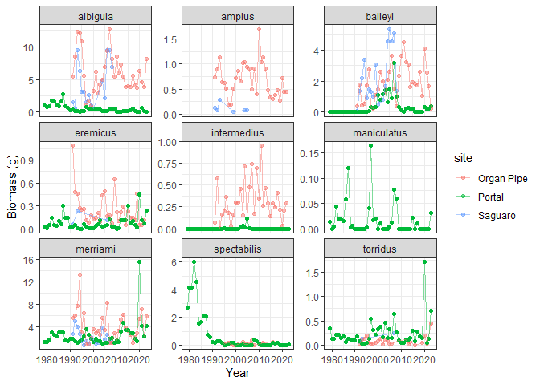
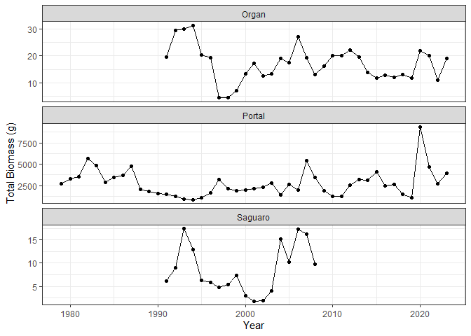
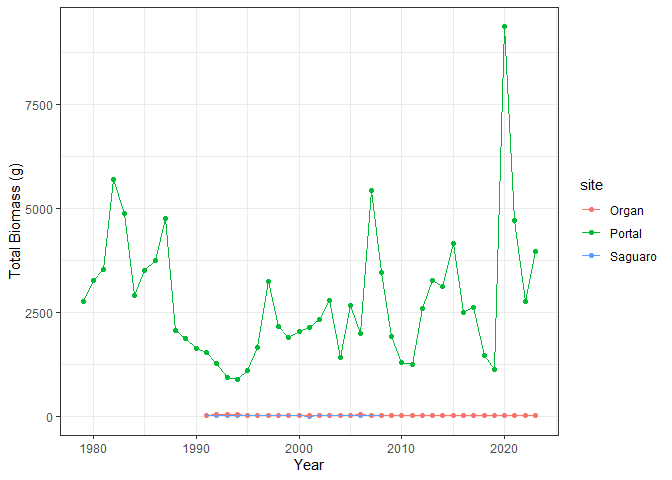
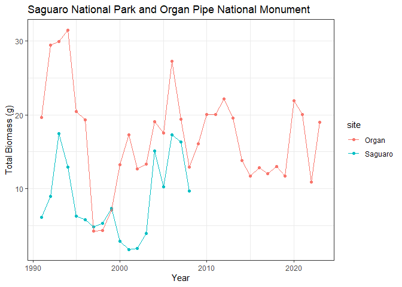
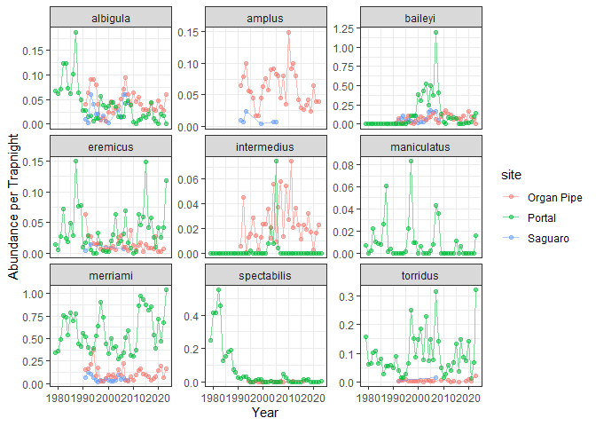

data_comparison
================
Hannah Dempsey

# Comparing Field Site Statistics

Set up:

``` r
library(tidyverse)
```

    ## ── Attaching core tidyverse packages ──────────────────────── tidyverse 2.0.0 ──
    ## ✔ dplyr     1.1.4     ✔ readr     2.1.5
    ## ✔ forcats   1.0.0     ✔ stringr   1.5.1
    ## ✔ ggplot2   3.5.1     ✔ tibble    3.2.1
    ## ✔ lubridate 1.9.4     ✔ tidyr     1.3.1
    ## ✔ purrr     1.0.4     
    ## ── Conflicts ────────────────────────────────────────── tidyverse_conflicts() ──
    ## ✖ dplyr::filter() masks stats::filter()
    ## ✖ dplyr::lag()    masks stats::lag()
    ## ℹ Use the conflicted package (<http://conflicted.r-lib.org/>) to force all conflicts to become errors

``` r
library(portalr)
```

### Biomass Data

#### By species:

Adjusting Portal’s biomass for multiple surveys per year:

``` r
#Loading in data
portal_biomass <- read_csv("../data_clean/portal_biomass.csv")
```

    ## Rows: 430920 Columns: 5
    ## ── Column specification ────────────────────────────────────────────────────────
    ## Delimiter: ","
    ## chr (1): species
    ## dbl (4): year, avg_weight_g, abund_per_trapnight, biomass_g
    ## 
    ## ℹ Use `spec()` to retrieve the full column specification for this data.
    ## ℹ Specify the column types or set `show_col_types = FALSE` to quiet this message.

``` r
portal_trapping <- read_csv("../data_clean/portal_trapping.csv")
```

    ## Rows: 12576 Columns: 8
    ## ── Column specification ────────────────────────────────────────────────────────
    ## Delimiter: ","
    ## dbl (8): day, month, year, period, plot, sampled, effort, qcflag
    ## 
    ## ℹ Use `spec()` to retrieve the full column specification for this data.
    ## ℹ Specify the column types or set `show_col_types = FALSE` to quiet this message.

``` r
#calculating number of periods per year
portal_periods <- portal_trapping %>% 
  group_by(year) %>% 
  summarize(periods = unique(period))
```

    ## Warning: Returning more (or less) than 1 row per `summarise()` group was deprecated in
    ## dplyr 1.1.0.
    ## ℹ Please use `reframe()` instead.
    ## ℹ When switching from `summarise()` to `reframe()`, remember that `reframe()`
    ##   always returns an ungrouped data frame and adjust accordingly.
    ## Call `lifecycle::last_lifecycle_warnings()` to see where this warning was
    ## generated.

    ## `summarise()` has grouped output by 'year'. You can override using the
    ## `.groups` argument.

``` r
portal_periods
```

    ## # A tibble: 525 × 2
    ## # Groups:   year [47]
    ##     year periods
    ##    <dbl>   <dbl>
    ##  1  1977       1
    ##  2  1977       2
    ##  3  1977       3
    ##  4  1977       4
    ##  5  1977       5
    ##  6  1977       6
    ##  7  1978       7
    ##  8  1978       8
    ##  9  1978       9
    ## 10  1978      10
    ## # ℹ 515 more rows

``` r
portal_periods_annual <- portal_periods %>% 
  group_by(year) %>% 
  summarize(n_periods = n())
portal_periods_annual
```

    ## # A tibble: 47 × 2
    ##     year n_periods
    ##    <dbl>     <int>
    ##  1  1977         6
    ##  2  1978        12
    ##  3  1979        11
    ##  4  1980        12
    ##  5  1981        12
    ##  6  1982        11
    ##  7  1983        12
    ##  8  1984        10
    ##  9  1985        11
    ## 10  1986        10
    ## # ℹ 37 more rows

``` r
#dividing biomass by number of periods
adjusted_portal_biomass <- portal_biomass %>% 
  inner_join(portal_periods_annual, join_by(year)) %>% 
  mutate(adjusted_biomass_g = biomass_g / n_periods) %>% 
  select(1:2, 7) %>% 
  #renaming so all column names across sites are the same
  rename(biomass_g = adjusted_biomass_g)
adjusted_portal_biomass
```

    ## # A tibble: 430,920 × 3
    ##     year species biomass_g
    ##    <dbl> <chr>       <dbl>
    ##  1  1979 BA              0
    ##  2  1980 BA              0
    ##  3  1981 BA              0
    ##  4  1982 BA              0
    ##  5  1983 BA              0
    ##  6  1984 BA              0
    ##  7  1985 BA              0
    ##  8  1986 BA              0
    ##  9  1987 BA              0
    ## 10  1988 BA              0
    ## # ℹ 430,910 more rows

Modify portal’s species column to match:

``` r
#load in species data
portal_species <- read_csv("../data_clean/portal_species.csv")
```

    ## Rows: 50 Columns: 15
    ## ── Column specification ────────────────────────────────────────────────────────
    ## Delimiter: ","
    ## chr  (4): species, scientificname, taxa, commonname
    ## dbl (11): censustarget, unidentified, rodent, granivore, minhfl, meanhfl, ma...
    ## 
    ## ℹ Use `spec()` to retrieve the full column specification for this data.
    ## ℹ Specify the column types or set `show_col_types = FALSE` to quiet this message.

``` r
#distinguish between hispidus spp
adjusted_portal_species <- portal_species %>% 
  mutate(scientificname = str_replace(scientificname, "Chaetodipus hispidus", " C.hispidus")) %>% 
  mutate(scientificname = str_replace(scientificname, "Sigmodon hispidus", " S.hispidus")) %>% 
  separate(scientificname, c("genus", "species_name"), sep = " ") %>% 
  select(1, 3)
adjusted_portal_species
```

    ## # A tibble: 50 × 2
    ##    species species_name
    ##    <chr>   <chr>       
    ##  1 AH      harrisi     
    ##  2 BA      taylori     
    ##  3 PB      baileyi     
    ##  4 PH      C.hispidus  
    ##  5 PI      intermedius 
    ##  6 PP      penicillatus
    ##  7 PX      sp.         
    ##  8 DM      merriami    
    ##  9 DO      ordii       
    ## 10 DX      sp.         
    ## # ℹ 40 more rows

``` r
#join to biomass dataframe
adjusted_portal_biomass <- adjusted_portal_biomass %>% 
  left_join(adjusted_portal_species, join_by(species)) %>% 
  select(1, 4, 3) %>% 
  rename(species = species_name)
adjusted_portal_biomass
```

    ## # A tibble: 430,920 × 3
    ##     year species biomass_g
    ##    <dbl> <chr>       <dbl>
    ##  1  1979 taylori         0
    ##  2  1980 taylori         0
    ##  3  1981 taylori         0
    ##  4  1982 taylori         0
    ##  5  1983 taylori         0
    ##  6  1984 taylori         0
    ##  7  1985 taylori         0
    ##  8  1986 taylori         0
    ##  9  1987 taylori         0
    ## 10  1988 taylori         0
    ## # ℹ 430,910 more rows

Adding site column to all dataframes:

``` r
#loading in the rest of the data
saguaro_biomass <- read_csv("../data_clean/saguaro_biomass.csv")
```

    ## Rows: 80 Columns: 3
    ## ── Column specification ────────────────────────────────────────────────────────
    ## Delimiter: ","
    ## chr (1): species
    ## dbl (2): year, biomass_g
    ## 
    ## ℹ Use `spec()` to retrieve the full column specification for this data.
    ## ℹ Specify the column types or set `show_col_types = FALSE` to quiet this message.

``` r
orpi_biomass <- read_csv("../data_clean/orpi_biomass.csv")
```

    ## Rows: 290 Columns: 3
    ## ── Column specification ────────────────────────────────────────────────────────
    ## Delimiter: ","
    ## chr (1): species
    ## dbl (2): year, biomass_g
    ## 
    ## ℹ Use `spec()` to retrieve the full column specification for this data.
    ## ℹ Specify the column types or set `show_col_types = FALSE` to quiet this message.

``` r
#adding site column to each dataframe
saguaro_biomass <- saguaro_biomass %>% 
  mutate(site = "Saguaro")
saguaro_biomass
```

    ## # A tibble: 80 × 4
    ##     year species      biomass_g site   
    ##    <dbl> <chr>            <dbl> <chr>  
    ##  1  1991 albigula        1.59   Saguaro
    ##  2  1991 amplus          0.125  Saguaro
    ##  3  1991 baileyi         0.0991 Saguaro
    ##  4  1991 eremicus        0.0577 Saguaro
    ##  5  1991 merriami        2.78   Saguaro
    ##  6  1991 penicillatus    1.47   Saguaro
    ##  7  1992 albigula        0.531  Saguaro
    ##  8  1992 amplus          0.0832 Saguaro
    ##  9  1992 baileyi         1.39   Saguaro
    ## 10  1992 merriami        5.02   Saguaro
    ## # ℹ 70 more rows

``` r
orpi_biomass <- orpi_biomass %>% 
   mutate(site = "Organ Pipe")
orpi_biomass
```

    ## # A tibble: 290 × 4
    ##     year species      biomass_g site      
    ##    <dbl> <chr>            <dbl> <chr>     
    ##  1  1991 albigula        5.49   Organ Pipe
    ##  2  1991 amplus          0.728  Organ Pipe
    ##  3  1991 arizonae        0.254  Organ Pipe
    ##  4  1991 baileyi         0.365  Organ Pipe
    ##  5  1991 eremicus        1.09   Organ Pipe
    ##  6  1991 intermedius     0.0743 Organ Pipe
    ##  7  1991 merriami        5.62   Organ Pipe
    ##  8  1991 penicillatus    6.01   Organ Pipe
    ##  9  1992 albigula        8.62   Organ Pipe
    ## 10  1992 amplus          0.894  Organ Pipe
    ## # ℹ 280 more rows

``` r
adjusted_portal_biomass <- adjusted_portal_biomass %>% 
   mutate(site = "Portal")
adjusted_portal_biomass
```

    ## # A tibble: 430,920 × 4
    ##     year species biomass_g site  
    ##    <dbl> <chr>       <dbl> <chr> 
    ##  1  1979 taylori         0 Portal
    ##  2  1980 taylori         0 Portal
    ##  3  1981 taylori         0 Portal
    ##  4  1982 taylori         0 Portal
    ##  5  1983 taylori         0 Portal
    ##  6  1984 taylori         0 Portal
    ##  7  1985 taylori         0 Portal
    ##  8  1986 taylori         0 Portal
    ##  9  1987 taylori         0 Portal
    ## 10  1988 taylori         0 Portal
    ## # ℹ 430,910 more rows

Bind dataframes into one:

``` r
all_biomass <- bind_rows(saguaro_biomass, orpi_biomass, adjusted_portal_biomass)
all_biomass
```

    ## # A tibble: 431,290 × 4
    ##     year species      biomass_g site   
    ##    <dbl> <chr>            <dbl> <chr>  
    ##  1  1991 albigula        1.59   Saguaro
    ##  2  1991 amplus          0.125  Saguaro
    ##  3  1991 baileyi         0.0991 Saguaro
    ##  4  1991 eremicus        0.0577 Saguaro
    ##  5  1991 merriami        2.78   Saguaro
    ##  6  1991 penicillatus    1.47   Saguaro
    ##  7  1992 albigula        0.531  Saguaro
    ##  8  1992 amplus          0.0832 Saguaro
    ##  9  1992 baileyi         1.39   Saguaro
    ## 10  1992 merriami        5.02   Saguaro
    ## # ℹ 431,280 more rows

Plotting annual biomass of each species:

``` r
all_biomass %>% 
  filter(species %in% c("albigula", "amplus", "baileyi", "eremicus", "intermedius", "maniculatus", "merriami", "spectabilis", "torridus")) %>% 
  ggplot(., aes(x = year, y = biomass_g, color = site)) +
    geom_point(alpha = 0.5) +
    geom_line(alpha = 0.5) +
    facet_wrap(~species, scales = "free_y") +
    labs(y = "Biomass (g)", x = "Year") +
    theme_bw()
```

<!-- -->

``` r
ggsave("../figures/all_biomass.png")
```

    ## Saving 7 x 5 in image

#### By community:

Adjusting Portal’s biomass for multiple surveys per year:

``` r
#loading in data
portal_total_biomass <- read_csv("../data_clean/portal_total_biomass.csv")
```

    ## Rows: 45 Columns: 2
    ## ── Column specification ────────────────────────────────────────────────────────
    ## Delimiter: ","
    ## dbl (2): year, biomass_g
    ## 
    ## ℹ Use `spec()` to retrieve the full column specification for this data.
    ## ℹ Specify the column types or set `show_col_types = FALSE` to quiet this message.

``` r
adjusted_portal_total_biomass <- portal_total_biomass %>% 
  left_join(portal_periods_annual) %>% 
  mutate(adjusted_biomass_g = biomass_g / n_periods) %>% 
  select(1, 4) %>% 
  rename(biomass_g = adjusted_biomass_g)
```

    ## Joining with `by = join_by(year)`

``` r
adjusted_portal_total_biomass
```

    ## # A tibble: 45 × 2
    ##     year biomass_g
    ##    <dbl>     <dbl>
    ##  1  1979     2747.
    ##  2  1980     3261.
    ##  3  1981     3524.
    ##  4  1982     5693.
    ##  5  1983     4865.
    ##  6  1984     2907.
    ##  7  1985     3492.
    ##  8  1986     3744.
    ##  9  1987     4746.
    ## 10  1988     2052.
    ## # ℹ 35 more rows

Adding site column to all dataframes:

``` r
#loading in the rest of the data
saguaro_total_biomass <- read_csv("../data_clean/saguaro_total_biomass.csv")
```

    ## Rows: 18 Columns: 2
    ## ── Column specification ────────────────────────────────────────────────────────
    ## Delimiter: ","
    ## dbl (2): year, biomass_g
    ## 
    ## ℹ Use `spec()` to retrieve the full column specification for this data.
    ## ℹ Specify the column types or set `show_col_types = FALSE` to quiet this message.

``` r
orpi_total_biomass <- read_csv("../data_clean/orpi_total_biomass.csv")
```

    ## Rows: 33 Columns: 2
    ## ── Column specification ────────────────────────────────────────────────────────
    ## Delimiter: ","
    ## dbl (2): year, biomass_g
    ## 
    ## ℹ Use `spec()` to retrieve the full column specification for this data.
    ## ℹ Specify the column types or set `show_col_types = FALSE` to quiet this message.

``` r
#adding site column to each dataframe
saguaro_total_biomass <- saguaro_total_biomass %>% 
  mutate(site = "Saguaro")
saguaro_total_biomass
```

    ## # A tibble: 18 × 3
    ##     year biomass_g site   
    ##    <dbl>     <dbl> <chr>  
    ##  1  1991      6.12 Saguaro
    ##  2  1992      8.94 Saguaro
    ##  3  1993     17.4  Saguaro
    ##  4  1994     12.9  Saguaro
    ##  5  1995      6.30 Saguaro
    ##  6  1996      5.85 Saguaro
    ##  7  1997      4.85 Saguaro
    ##  8  1998      5.34 Saguaro
    ##  9  1999      7.38 Saguaro
    ## 10  2000      2.93 Saguaro
    ## 11  2001      1.82 Saguaro
    ## 12  2002      1.98 Saguaro
    ## 13  2003      3.97 Saguaro
    ## 14  2004     15.1  Saguaro
    ## 15  2005     10.2  Saguaro
    ## 16  2006     17.3  Saguaro
    ## 17  2007     16.3  Saguaro
    ## 18  2008      9.74 Saguaro

``` r
orpi_total_biomass <- orpi_total_biomass %>% 
   mutate(site = "Organ")
orpi_total_biomass
```

    ## # A tibble: 33 × 3
    ##     year biomass_g site 
    ##    <dbl>     <dbl> <chr>
    ##  1  1991     19.6  Organ
    ##  2  1992     29.4  Organ
    ##  3  1993     29.9  Organ
    ##  4  1994     31.4  Organ
    ##  5  1995     20.5  Organ
    ##  6  1996     19.3  Organ
    ##  7  1997      4.33 Organ
    ##  8  1998      4.40 Organ
    ##  9  1999      7.09 Organ
    ## 10  2000     13.2  Organ
    ## # ℹ 23 more rows

``` r
adjusted_portal_total_biomass <- adjusted_portal_total_biomass %>% 
   mutate(site = "Portal")
adjusted_portal_total_biomass
```

    ## # A tibble: 45 × 3
    ##     year biomass_g site  
    ##    <dbl>     <dbl> <chr> 
    ##  1  1979     2747. Portal
    ##  2  1980     3261. Portal
    ##  3  1981     3524. Portal
    ##  4  1982     5693. Portal
    ##  5  1983     4865. Portal
    ##  6  1984     2907. Portal
    ##  7  1985     3492. Portal
    ##  8  1986     3744. Portal
    ##  9  1987     4746. Portal
    ## 10  1988     2052. Portal
    ## # ℹ 35 more rows

Bind dataframes into one:

``` r
all_total_biomass <- bind_rows(saguaro_total_biomass, orpi_total_biomass, adjusted_portal_total_biomass)
```

Plotting community biomass:

``` r
#facet_wrapped
ggplot(all_total_biomass, aes(x = year, y = biomass_g)) +
  geom_point() +
  geom_line() +
  facet_wrap(~site, scales = "free_y", ncol = 1) +
  labs(y = "Total Biomass (g)", x = "Year") +
  theme_bw()
```

<!-- -->

``` r
ggsave("../figures/all_total_biomass.png")
```

    ## Saving 7 x 5 in image

``` r
#by color
ggplot(all_total_biomass, aes(x = year, y = biomass_g, color = site)) +
  geom_point() +
  geom_line() +
  labs(y = "Total Biomass (g)", x = "Year") +
  theme_bw()
```

<!-- -->

``` r
#just saguaro and orpi
all_total_biomass %>% 
  filter(site != "Portal") %>% 
  ggplot(., aes(x = year, y = biomass_g, color = site)) +
  geom_point() +
  geom_line() +
  labs(y = "Total Biomass (g)", x = "Year", title = "Saguaro National Park and Organ Pipe National Monument") +
  theme_bw()
```

<!-- -->

``` r
ggsave("../figures/saguaro_orpi_total_biomass.png")
```

    ## Saving 7 x 5 in image

### Abundance Data

Loading in datasets:

``` r
saguaro_abund <- read_csv("../data_clean/saguaro_abund_trapnights.csv")
```

    ## Rows: 80 Columns: 6
    ## ── Column specification ────────────────────────────────────────────────────────
    ## Delimiter: ","
    ## chr (1): species
    ## dbl (5): year, abundance, nights, trap_nights, abund_per_trapnight
    ## 
    ## ℹ Use `spec()` to retrieve the full column specification for this data.
    ## ℹ Specify the column types or set `show_col_types = FALSE` to quiet this message.

``` r
orpi_abund <- read_csv("../data_clean/orpi_abund_trapnights.csv")
```

    ## Rows: 290 Columns: 5
    ## ── Column specification ────────────────────────────────────────────────────────
    ## Delimiter: ","
    ## chr (1): species
    ## dbl (4): year, abundance, trap_nights, abund_per_trapnight
    ## 
    ## ℹ Use `spec()` to retrieve the full column specification for this data.
    ## ℹ Specify the column types or set `show_col_types = FALSE` to quiet this message.

``` r
portal_abund <- read_csv("../data_clean/portal_abund_trapnights.csv")
```

    ## Rows: 945 Columns: 5
    ## ── Column specification ────────────────────────────────────────────────────────
    ## Delimiter: ","
    ## chr (1): species
    ## dbl (4): year, abundance, effort, abund_per_trapnight
    ## 
    ## ℹ Use `spec()` to retrieve the full column specification for this data.
    ## ℹ Specify the column types or set `show_col_types = FALSE` to quiet this message.

``` r
#removing superfluous columns
saguaro_abund <- saguaro_abund %>% 
  select(1, 2, 6)
saguaro_abund
```

    ## # A tibble: 80 × 3
    ##     year species      abund_per_trapnight
    ##    <dbl> <chr>                      <dbl>
    ##  1  1991 albigula                 0.0101 
    ##  2  1991 amplus                   0.0101 
    ##  3  1991 baileyi                  0.00338
    ##  4  1991 eremicus                 0.00338
    ##  5  1991 merriami                 0.0709 
    ##  6  1991 penicillatus             0.0777 
    ##  7  1992 albigula                 0.00338
    ##  8  1992 amplus                   0.00676
    ##  9  1992 baileyi                  0.0473 
    ## 10  1992 merriami                 0.128  
    ## # ℹ 70 more rows

``` r
orpi_abund <- orpi_abund %>% 
  select(1, 2, 5)
orpi_abund
```

    ## # A tibble: 290 × 3
    ##     year species      abund_per_trapnight
    ##    <dbl> <chr>                      <dbl>
    ##  1  1991 albigula                 0.0408 
    ##  2  1991 amplus                   0.0641 
    ##  3  1991 arizonae                 0.00292
    ##  4  1991 baileyi                  0.0146 
    ##  5  1991 eremicus                 0.0627 
    ##  6  1991 intermedius              0.00583
    ##  7  1991 merriami                 0.156  
    ##  8  1991 penicillatus             0.386  
    ##  9  1992 albigula                 0.0641 
    ## 10  1992 amplus                   0.0787 
    ## # ℹ 280 more rows

``` r
portal_abund <- portal_abund %>% 
  select(1, 2, 5)
portal_abund
```

    ## # A tibble: 945 × 3
    ##     year species abund_per_trapnight
    ##    <dbl> <chr>                 <dbl>
    ##  1  1979 BA                   0     
    ##  2  1979 DM                   0.340 
    ##  3  1979 DO                   0.0544
    ##  4  1979 DS                   0.252 
    ##  5  1979 OL                   0.0816
    ##  6  1979 OT                   0.156 
    ##  7  1979 PB                   0     
    ##  8  1979 PE                   0.0136
    ##  9  1979 PF                   0.0136
    ## 10  1979 PH                   0     
    ## # ℹ 935 more rows

``` r
#adding site column to each dataframe
saguaro_abund <- saguaro_abund %>% 
  mutate(site = "Saguaro")
saguaro_abund
```

    ## # A tibble: 80 × 4
    ##     year species      abund_per_trapnight site   
    ##    <dbl> <chr>                      <dbl> <chr>  
    ##  1  1991 albigula                 0.0101  Saguaro
    ##  2  1991 amplus                   0.0101  Saguaro
    ##  3  1991 baileyi                  0.00338 Saguaro
    ##  4  1991 eremicus                 0.00338 Saguaro
    ##  5  1991 merriami                 0.0709  Saguaro
    ##  6  1991 penicillatus             0.0777  Saguaro
    ##  7  1992 albigula                 0.00338 Saguaro
    ##  8  1992 amplus                   0.00676 Saguaro
    ##  9  1992 baileyi                  0.0473  Saguaro
    ## 10  1992 merriami                 0.128   Saguaro
    ## # ℹ 70 more rows

``` r
orpi_abund <- orpi_abund %>% 
   mutate(site = "Organ Pipe")
orpi_abund
```

    ## # A tibble: 290 × 4
    ##     year species      abund_per_trapnight site      
    ##    <dbl> <chr>                      <dbl> <chr>     
    ##  1  1991 albigula                 0.0408  Organ Pipe
    ##  2  1991 amplus                   0.0641  Organ Pipe
    ##  3  1991 arizonae                 0.00292 Organ Pipe
    ##  4  1991 baileyi                  0.0146  Organ Pipe
    ##  5  1991 eremicus                 0.0627  Organ Pipe
    ##  6  1991 intermedius              0.00583 Organ Pipe
    ##  7  1991 merriami                 0.156   Organ Pipe
    ##  8  1991 penicillatus             0.386   Organ Pipe
    ##  9  1992 albigula                 0.0641  Organ Pipe
    ## 10  1992 amplus                   0.0787  Organ Pipe
    ## # ℹ 280 more rows

``` r
portal_abund <- portal_abund %>% 
   mutate(site = "Portal")
portal_abund
```

    ## # A tibble: 945 × 4
    ##     year species abund_per_trapnight site  
    ##    <dbl> <chr>                 <dbl> <chr> 
    ##  1  1979 BA                   0      Portal
    ##  2  1979 DM                   0.340  Portal
    ##  3  1979 DO                   0.0544 Portal
    ##  4  1979 DS                   0.252  Portal
    ##  5  1979 OL                   0.0816 Portal
    ##  6  1979 OT                   0.156  Portal
    ##  7  1979 PB                   0      Portal
    ##  8  1979 PE                   0.0136 Portal
    ##  9  1979 PF                   0.0136 Portal
    ## 10  1979 PH                   0      Portal
    ## # ℹ 935 more rows

Modifying Portal’s species column to match:

``` r
portal_abund <- portal_abund %>% 
  left_join(adjusted_portal_species, join_by(species)) %>% 
  select(1, 5, 3, 4) %>% 
  rename(species = species_name)
portal_abund
```

    ## # A tibble: 945 × 4
    ##     year species     abund_per_trapnight site  
    ##    <dbl> <chr>                     <dbl> <chr> 
    ##  1  1979 taylori                  0      Portal
    ##  2  1979 merriami                 0.340  Portal
    ##  3  1979 ordii                    0.0544 Portal
    ##  4  1979 spectabilis              0.252  Portal
    ##  5  1979 leucogaster              0.0816 Portal
    ##  6  1979 torridus                 0.156  Portal
    ##  7  1979 baileyi                  0      Portal
    ##  8  1979 eremicus                 0.0136 Portal
    ##  9  1979 flavus                   0.0136 Portal
    ## 10  1979 C.hispidus               0      Portal
    ## # ℹ 935 more rows

Bind dataframes into one

``` r
all_abund <- bind_rows(saguaro_abund, orpi_abund, portal_abund)
all_abund
```

    ## # A tibble: 1,315 × 4
    ##     year species      abund_per_trapnight site   
    ##    <dbl> <chr>                      <dbl> <chr>  
    ##  1  1991 albigula                 0.0101  Saguaro
    ##  2  1991 amplus                   0.0101  Saguaro
    ##  3  1991 baileyi                  0.00338 Saguaro
    ##  4  1991 eremicus                 0.00338 Saguaro
    ##  5  1991 merriami                 0.0709  Saguaro
    ##  6  1991 penicillatus             0.0777  Saguaro
    ##  7  1992 albigula                 0.00338 Saguaro
    ##  8  1992 amplus                   0.00676 Saguaro
    ##  9  1992 baileyi                  0.0473  Saguaro
    ## 10  1992 merriami                 0.128   Saguaro
    ## # ℹ 1,305 more rows

Plotting abundance of each species:

``` r
all_abund %>% 
  filter(species %in% c("albigula", "amplus", "baileyi", "eremicus", "intermedius", "maniculatus", "merriami", "spectabilis", "torridus")) %>% 
  ggplot(., aes(x = year, y = abund_per_trapnight, color = site)) +
    geom_point(alpha = 0.5) +
    geom_line(alpha = 0.5) +
    facet_wrap(~species, scales = "free_y") +
    labs(y = "Abundance per Trapnight", x = "Year") +
    theme_bw()
```

<!-- -->

``` r
ggsave("../figures/all_abund.png")
```

    ## Saving 7 x 5 in image
