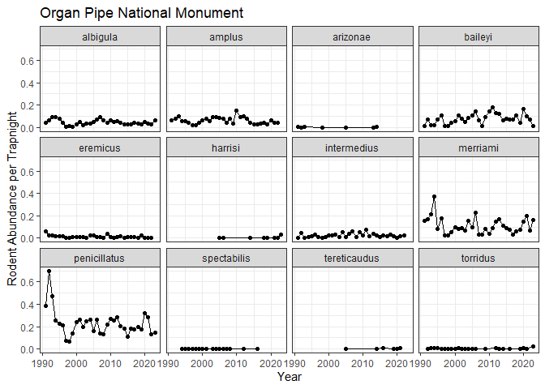

orpi_analysis
================
Hannah Dempsey

# Organ Pipe National Monument Analysis

Set up:

``` r
library(tidyverse)
```

    ## ── Attaching core tidyverse packages ──────────────────────── tidyverse 2.0.0 ──
    ## ✔ dplyr     1.1.4     ✔ readr     2.1.5
    ## ✔ forcats   1.0.0     ✔ stringr   1.5.1
    ## ✔ ggplot2   3.5.1     ✔ tibble    3.2.1
    ## ✔ lubridate 1.9.4     ✔ tidyr     1.3.1
    ## ✔ purrr     1.0.4     
    ## ── Conflicts ────────────────────────────────────────── tidyverse_conflicts() ──
    ## ✖ dplyr::filter() masks stats::filter()
    ## ✖ dplyr::lag()    masks stats::lag()
    ## ℹ Use the conflicted package (<http://conflicted.r-lib.org/>) to force all conflicts to become errors

``` r
orpi_clean <- read_csv("../data_clean/orpi_clean.csv")
```

    ## Rows: 29880 Columns: 16
    ## ── Column specification ────────────────────────────────────────────────────────
    ## Delimiter: ","
    ## chr  (6): species_code, genus, species, family, weather, notes
    ## dbl  (8): id, rodent_survey_id, rodent_species_id, weight, recapture, site_i...
    ## date (2): start_date, end_date
    ## 
    ## ℹ Use `spec()` to retrieve the full column specification for this data.
    ## ℹ Specify the column types or set `show_col_types = FALSE` to quiet this message.

``` r
orpi_surveys <- read_csv("../data_clean/orpi_surveys.csv")
```

    ## Rows: 704 Columns: 8
    ## ── Column specification ────────────────────────────────────────────────────────
    ## Delimiter: ","
    ## chr  (2): weather, notes
    ## dbl  (4): rodent_survey_id, site_id, quadrat, num_traps
    ## date (2): start_date, end_date
    ## 
    ## ℹ Use `spec()` to retrieve the full column specification for this data.
    ## ℹ Specify the column types or set `show_col_types = FALSE` to quiet this message.

### Abundance Data

Summarize the survey data by year:

``` r
trap_nights <- orpi_surveys %>% 
  mutate(year = year(end_date),
         nights = end_date - start_date,
         trap_nights = num_traps * nights) %>% 
  group_by(year) %>% 
  summarize(trap_nights = as.numeric(sum(trap_nights)))
trap_nights
```

    ## # A tibble: 33 × 2
    ##     year trap_nights
    ##    <dbl>       <dbl>
    ##  1  1991         686
    ##  2  1992         686
    ##  3  1993        1519
    ##  4  1994        1225
    ##  5  1995        1666
    ##  6  1996        1666
    ##  7  1997        3332
    ##  8  1998        3835
    ##  9  1999        3550
    ## 10  2000        1666
    ## # ℹ 23 more rows

Calculate the annual abundance for each species per trapnight:

``` r
rodents_per_trapnight <- orpi_clean %>% 
  mutate(year = year(end_date)) %>%  
  group_by(year, species) %>% 
  summarize(abundance = sum(recapture == 0)) %>% 
  inner_join(trap_nights, join_by(year)) %>% 
  mutate(abund_per_trapnight = abundance / trap_nights)
```

    ## `summarise()` has grouped output by 'year'. You can override using the
    ## `.groups` argument.

``` r
rodents_per_trapnight
```

    ## # A tibble: 290 × 5
    ## # Groups:   year [33]
    ##     year species      abundance trap_nights abund_per_trapnight
    ##    <dbl> <chr>            <int>       <dbl>               <dbl>
    ##  1  1991 albigula            28         686             0.0408 
    ##  2  1991 amplus              44         686             0.0641 
    ##  3  1991 arizonae             2         686             0.00292
    ##  4  1991 baileyi             10         686             0.0146 
    ##  5  1991 eremicus            43         686             0.0627 
    ##  6  1991 intermedius          4         686             0.00583
    ##  7  1991 merriami           107         686             0.156  
    ##  8  1991 penicillatus       265         686             0.386  
    ##  9  1992 albigula            44         686             0.0641 
    ## 10  1992 amplus              54         686             0.0787 
    ## # ℹ 280 more rows

``` r
#save dataframe for comparison
write_csv(rodents_per_trapnight, "../data_clean/orpi_abund_trapnights.csv")
```

Plotting abundance per trapnight:

``` r
#only one data point for maniculatus, so I'm removing it from the graph
orpi_abundance <- rodents_per_trapnight %>% 
  filter(species != "maniculatus") %>% 
  ggplot(., aes(x = year, y = abund_per_trapnight)) +
  geom_point() +
  geom_line() +
  facet_wrap(~ species) +
  labs(y = "Rodent Abundance per Trapnight", x = "Year", title = "Organ Pipe National Monument") +
  theme_bw()
orpi_abundance
```

<!-- -->

``` r
ggsave("../figures/orpi_abundance.png")
```

    ## Saving 7 x 5 in image

### Biomass Data

Calculating average mass for each species:

``` r
rodent_mass <- orpi_clean %>% 
  group_by(species) %>% 
  summarize(avg_mass_g = mean(weight, na.rm = TRUE))
rodent_mass
```

    ## # A tibble: 13 × 2
    ##    species      avg_mass_g
    ##    <chr>             <dbl>
    ##  1 albigula          134. 
    ##  2 amplus             11.4
    ##  3 arizonae           87.3
    ##  4 baileyi            25.1
    ##  5 eremicus           17.4
    ##  6 harrisi            65  
    ##  7 intermedius        12.7
    ##  8 maniculatus        19  
    ##  9 merriami           36.1
    ## 10 penicillatus       15.6
    ## 11 spectabilis        96.4
    ## 12 tereticaudus       99.9
    ## 13 torridus           21.5

Calculate the annual biomass of each species:

``` r
biomass_annual <- rodents_per_trapnight %>% 
  inner_join(rodent_mass, join_by(species)) %>% 
  group_by(year, species) %>% 
  summarize(biomass_g = abund_per_trapnight * avg_mass_g)
```

    ## `summarise()` has grouped output by 'year'. You can override using the
    ## `.groups` argument.

``` r
biomass_annual
```

    ## # A tibble: 290 × 3
    ## # Groups:   year [33]
    ##     year species      biomass_g
    ##    <dbl> <chr>            <dbl>
    ##  1  1991 albigula        5.49  
    ##  2  1991 amplus          0.728 
    ##  3  1991 arizonae        0.254 
    ##  4  1991 baileyi         0.365 
    ##  5  1991 eremicus        1.09  
    ##  6  1991 intermedius     0.0743
    ##  7  1991 merriami        5.62  
    ##  8  1991 penicillatus    6.01  
    ##  9  1992 albigula        8.62  
    ## 10  1992 amplus          0.894 
    ## # ℹ 280 more rows

``` r
#save dataframe for comparison
write_csv(biomass_annual, "../data_clean/orpi_biomass.csv")
```

Plotting annual biomass of each species:

``` r
#only one data point for maniculatus, so I'm removing it from the graph
orpi_biomass <- biomass_annual %>% 
  filter(species != "maniculatus") %>% 
  ggplot(., aes(x = year, y = biomass_g)) +
  geom_point() +
  geom_line() +
  facet_wrap(~species) +
  labs(y = "Biomass (g)", x = "Year", title = "Organ Pipe National Monument") +
  theme_bw()
orpi_biomass
```

<!-- -->

``` r
ggsave("../figures/orpi_biomass.png")
```

    ## Saving 7 x 5 in image

Calculating annual community biomass:

``` r
total_biomass_annual <- biomass_annual %>% 
  group_by(year) %>% 
  summarize(biomass_g = sum(biomass_g))
total_biomass_annual
```

    ## # A tibble: 33 × 2
    ##     year biomass_g
    ##    <dbl>     <dbl>
    ##  1  1991     19.6 
    ##  2  1992     29.4 
    ##  3  1993     29.9 
    ##  4  1994     31.4 
    ##  5  1995     20.5 
    ##  6  1996     19.3 
    ##  7  1997      4.33
    ##  8  1998      4.40
    ##  9  1999      7.09
    ## 10  2000     13.2 
    ## # ℹ 23 more rows

``` r
#save dataframe for comparison
write_csv(total_biomass_annual, "../data_clean/orpi_total_biomass.csv")
```

Plotting annual community biomass:

``` r
orpi_total_biomass <- ggplot(total_biomass_annual, aes(x = year, y = biomass_g)) +
  geom_point() +
  geom_line() +
  labs(y = "Total Biomass (g)", x = "Year", title = "Organ Pipe National Monument") +
  theme_bw()
orpi_total_biomass
```

<!-- -->

``` r
ggsave("../figures/orpi_total_biomass.png")
```

    ## Saving 7 x 5 in image
