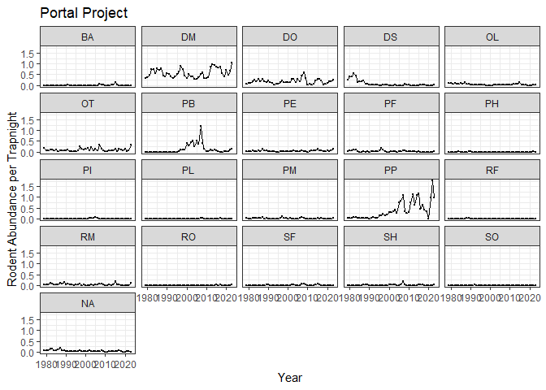
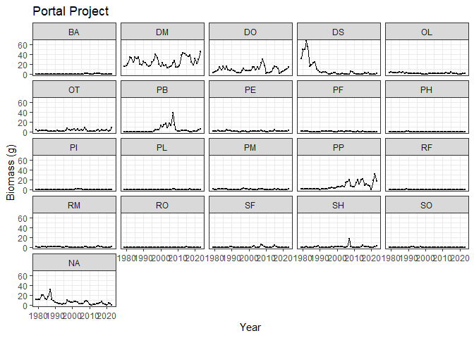
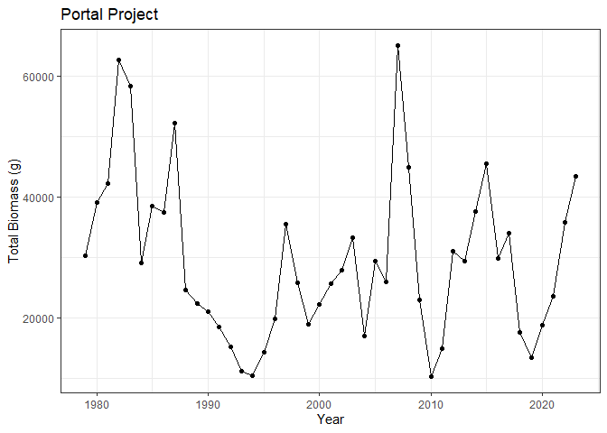

portal_analysis
================
Hannah Dempsey

# Portal Analysis

Set up:

``` r
library(tidyverse)
```

    ## ── Attaching core tidyverse packages ──────────────────────── tidyverse 2.0.0 ──
    ## ✔ dplyr     1.1.4     ✔ readr     2.1.5
    ## ✔ forcats   1.0.0     ✔ stringr   1.5.1
    ## ✔ ggplot2   3.5.1     ✔ tibble    3.2.1
    ## ✔ lubridate 1.9.4     ✔ tidyr     1.3.1
    ## ✔ purrr     1.0.4     
    ## ── Conflicts ────────────────────────────────────────── tidyverse_conflicts() ──
    ## ✖ dplyr::filter() masks stats::filter()
    ## ✖ dplyr::lag()    masks stats::lag()
    ## ℹ Use the conflicted package (<http://conflicted.r-lib.org/>) to force all conflicts to become errors

``` r
portal_abund <- read_csv("../data_clean/portal_abund.csv")
```

    ## Rows: 9576 Columns: 13
    ## ── Column specification ────────────────────────────────────────────────────────
    ## Delimiter: ","
    ## chr (5): treatment, species, scientific_name, taxa, common_name
    ## dbl (8): year, month, period, abundance, ntraps, nplots, avg_weight_g, effort
    ## 
    ## ℹ Use `spec()` to retrieve the full column specification for this data.
    ## ℹ Specify the column types or set `show_col_types = FALSE` to quiet this message.

### Abundance Data

Calculate the annual abundance for each species per trapnight:

``` r
rodents_per_trapnight <- portal_abund %>% 
  group_by(year, species) %>% 
  summarize(abundance = sum(abundance, na.rm = T),
            effort = sum(effort, na.rm = T)) %>% 
  mutate(abund_per_trapnight = abundance / effort)
```

    ## `summarise()` has grouped output by 'year'. You can override using the
    ## `.groups` argument.

``` r
rodents_per_trapnight
```

    ## # A tibble: 945 × 5
    ## # Groups:   year [45]
    ##     year species abundance effort abund_per_trapnight
    ##    <dbl> <chr>       <dbl>  <dbl>               <dbl>
    ##  1  1979 BA              0    147              0     
    ##  2  1979 DM             50    147              0.340 
    ##  3  1979 DO              8    147              0.0544
    ##  4  1979 DS             37    147              0.252 
    ##  5  1979 OL             12    147              0.0816
    ##  6  1979 OT             23    147              0.156 
    ##  7  1979 PB              0    147              0     
    ##  8  1979 PE              2    147              0.0136
    ##  9  1979 PF              2    147              0.0136
    ## 10  1979 PH              0    147              0     
    ## # ℹ 935 more rows

``` r
#save dataframe for comparison
write_csv(rodents_per_trapnight, "../data_clean/portal_abund_trapnights.csv")
```

Plotting abundance per trapnight:

``` r
portal_abundance <- ggplot(rodents_per_trapnight, aes(x = year, y = abund_per_trapnight)) +
  geom_point(size = 0.5) +
  geom_line() +
  facet_wrap(~ species) +
  labs(y = "Rodent Abundance per Trapnight", x = "Year", title = "Portal Project") +
  theme_bw()
portal_abundance
```

<!-- -->

``` r
ggsave("../figures/portal_abundance.png")
```

    ## Saving 7 x 5 in image

### Biomass Data

Calculate the annual biomass of each species:

``` r
biomass_annual <- portal_abund %>% 
  select(species, avg_weight_g) %>% 
  right_join(rodents_per_trapnight, join_by(species)) %>% 
  select(3, 1:2, 6) %>% 
  mutate(biomass_g = abund_per_trapnight * avg_weight_g)
```

    ## Warning in right_join(., rodents_per_trapnight, join_by(species)): Detected an unexpected many-to-many relationship between `x` and `y`.
    ## ℹ Row 1 of `x` matches multiple rows in `y`.
    ## ℹ Row 1 of `y` matches multiple rows in `x`.
    ## ℹ If a many-to-many relationship is expected, set `relationship =
    ##   "many-to-many"` to silence this warning.

``` r
biomass_annual
```

    ## # A tibble: 430,920 × 5
    ##     year species avg_weight_g abund_per_trapnight biomass_g
    ##    <dbl> <chr>          <dbl>               <dbl>     <dbl>
    ##  1  1979 BA              9.45                   0         0
    ##  2  1980 BA              9.45                   0         0
    ##  3  1981 BA              9.45                   0         0
    ##  4  1982 BA              9.45                   0         0
    ##  5  1983 BA              9.45                   0         0
    ##  6  1984 BA              9.45                   0         0
    ##  7  1985 BA              9.45                   0         0
    ##  8  1986 BA              9.45                   0         0
    ##  9  1987 BA              9.45                   0         0
    ## 10  1988 BA              9.45                   0         0
    ## # ℹ 430,910 more rows

``` r
#save dataframe for comparison
write_csv(biomass_annual, "../data_clean/portal_biomass.csv")
```

Plotting annual biomass of each species:

``` r
portal_biomass <- ggplot(biomass_annual, aes(x = year, y = biomass_g)) +
  geom_point(size = 0.5) +
  geom_line() +
  facet_wrap(~species) +
  labs(y = "Biomass (g)", x = "Year", title = "Portal Project") +
  theme_bw()
portal_biomass
```

<!-- -->

``` r
ggsave("../figures/portal_biomass.png")
```

    ## Saving 7 x 5 in image

Calculating annual community biomass:

``` r
total_biomass_annual <- biomass_annual %>% 
  group_by(year) %>% 
  summarize(biomass_g = sum(biomass_g))
total_biomass_annual
```

    ## # A tibble: 45 × 2
    ##     year biomass_g
    ##    <dbl>     <dbl>
    ##  1  1979    30221.
    ##  2  1980    39126.
    ##  3  1981    42286.
    ##  4  1982    62625.
    ##  5  1983    58381.
    ##  6  1984    29069.
    ##  7  1985    38417.
    ##  8  1986    37442.
    ##  9  1987    52204.
    ## 10  1988    24619.
    ## # ℹ 35 more rows

``` r
#save dataframe for comparison
write_csv(total_biomass_annual, "../data_clean/portal_total_biomass.csv")
```

Plotting annual community biomass:

``` r
portal_total_biomass <- ggplot(total_biomass_annual, aes(x = year, y = biomass_g)) +
  geom_point() +
  geom_line() +
  labs(y = "Total Biomass (g)", x = "Year", title = "Portal Project") +
  theme_bw()
portal_total_biomass
```

<!-- -->

``` r
ggsave("../figures/portal_total_biomass.png")
```

    ## Saving 7 x 5 in image
